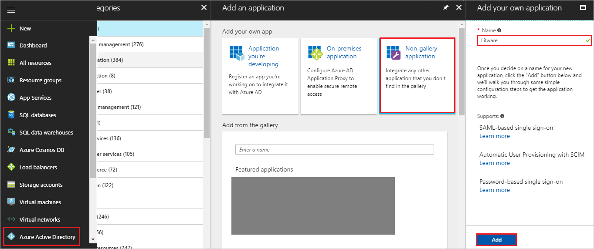
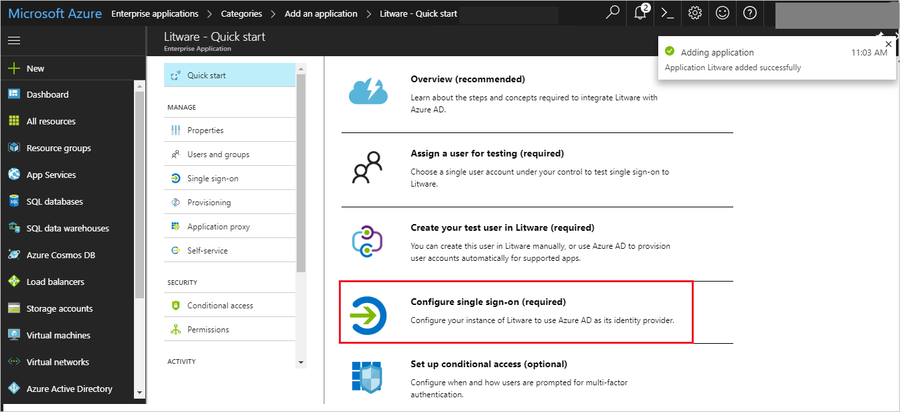
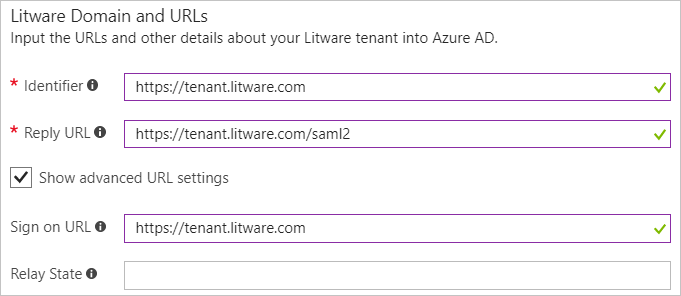
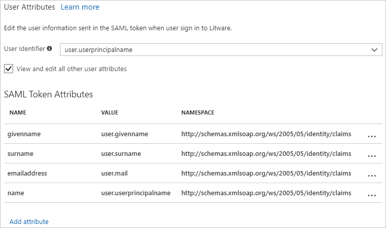
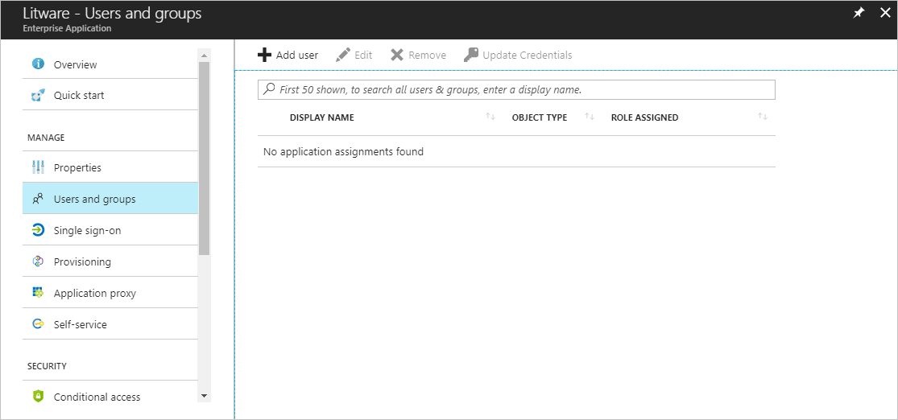

# Configure single sign-on to applications that are not in the Azure Active Directory application gallery

This article is about a feature that enables administrators to configure single sign-on to applications not present in the Azure Active Directory app gallery *without writing code*. This feature was released from technical preview on November 18, 2015 and is included in [Azure Active Directory Premium](fundamentals/active-directory-whatis.md). If you are instead looking for developer guidance on how to integrate custom apps with Azure AD through code, see [Authentication Scenarios for Azure AD](active-directory-authentication-scenarios.md).

The Azure Active Directory application gallery provides a listing of applications that are known to support a form of single sign-on with Azure Active Directory, as described in [this article](manage-apps/what-is-single-sign-on.md). Once you (as an IT specialist or system integrator in your organization) have found the application you want to connect, you can get started by following the step-by-step instructions presented in the Azure portal to enable single sign-on.

Customers with [Azure Active Directory Premium](fundamentals/active-directory-whatis.md) license also get these additional capabilities:

* Self-service integration of any application that supports SAML 2.0 identity providers (SP-initiated or IdP-initiated)
* Self-service integration of any web application that has an HTML-based sign-in page using [password-based SSO](manage-apps/what-is-single-sign-on.md#password-based-single-sign-on)
* Self-service connection of applications that use the SCIM protocol for user provisioning ([described here](manage-apps/use-scim-to-provision-users-and-groups.md))
* Ability to add links to any application in the [Office 365 app launcher](https://blogs.office.com/2014/10/16/organize-office-365-new-app-launcher-2/) or the [Azure AD access panel](manage-apps/what-is-single-sign-on.md#deploying-azure-ad-integrated-applications-to-users)

This can include not only SaaS applications that you use but have not yet been on-boarded to the Azure AD application gallery, but third-party web applications that your organization has deployed to servers you control, either in the cloud or on-premises.

These capabilities, also known as *app integration templates*, provide standards-based connection points for apps that support SAML, SCIM, or forms-based authentication, and include flexible options and settings for compatibility with a broad number of applications. 

## Adding an unlisted application
To connect an application using an app integration template, sign in to the Azure portal using your Azure Active Directory administrator account. Browse to the **Active Directory > Enterprise Applications > New application > Non-gallery application** section, select **Add**, and then **Add an application from the gallery**.

  

In the app gallery, you can add an unlisted app by selecting the **Non-gallery application** tile that is shown in the search results if your desired app wasn't found. After entering a Name for your application, you can configure the single sign-on options and behavior. 

**Quick tip**:  As a best practice, use the search function to check to see if the application already exists in the application gallery. If the app is found and its description mentions single sign-on, then the application is already supported for federated single sign-on.

  

Adding an application this way provides a similar experience to the one available for pre-integrated applications. To start, select **Configure Single Sign-On** or click on **Single sign-on** from the application’s left-hand navigation menu. The next screen presents the options for configuring single sign-on. The options are described in the next sections of this article.
  


## SAML-based single sign-on
Select this option to configure SAML-based authentication for the application. This requires that the application support SAML 2.0. You should collect information on how to use the SAML capabilities of the application before continuing. Complete the following sections to configure single sign-on between the application and Azure AD.

### Enter basic SAML configuration

To set up Azure AD, enter the basic SAML configuration. You can manually enter the values or upload a metadata file to extract the value of the fields.

  

- **Sign On URL (SP-initiated only)** – Where the user goes to sign-in to this application. If the application is configured to perform service provider-initiated single sign-on, then when a user navigates to this URL, the service provider will do the necessary redirection to Azure AD to authenticate and log on the user in. If this field is populated, then Azure AD will use this URL to launch the application from Office 365 and the Azure AD Access Panel. If this field is omitted, then Azure AD will instead perform identity provider -initiated sign-on when the app is launched from Office 365, the Azure AD Access Panel, or from the Azure AD single sign-on URL (copyable from the Dashboard tab).
- **Identifier** - should uniquely identify the application for which single sign-on is being configured. You can find this value as the Issuer element in the AuthRequest (SAML request) sent by the application. This value also appears as the **Entity ID** in any SAML metadata provided by the application. Check the application’s SAML documentation for details on what its Entity ID or Audience value is. 

    The following is an example of how the Identifier or Issuer appears in the SAML request sent by the application to Azure AD:

    ```
    <samlp:AuthnRequest
    xmlns="urn:oasis:names:tc:SAML:2.0:metadata"
    ID="id6c1c178c166d486687be4aaf5e482730"
    Version="2.0" IssueInstant="2013-03-18T03:28:54.1839884Z"
    xmlns:samlp="urn:oasis:names:tc:SAML:2.0:protocol">
    <Issuer xmlns="urn:oasis:names:tc:SAML:2.0:assertion">https://www.contoso.com</Issuer>
    </samlp:AuthnRequest>
    ```

- **Reply URL** - The reply URL is where the application expects to receive the SAML token. This is also referred to as the Assertion Consumer Service (ACS) URL. Check the application’s SAML documentation for details on what its SAML token reply URL or ACS URL is. 

    To configure multiple replyURLs you can use the following PowerShell script.

    ```PowerShell
    $sp = Get-AzureADServicePrincipal -SearchString "<Exact App  name>"
    $app = Get-AzureADApplication -SearchString "<Exact app name>"
    Set-AzureADApplication -ObjectId $app.ObjectId -ReplyUrls "<ReplyURLs>"
    Set-AzureADServicePrincipal -ObjectId $sp.ObjectId -ReplyUrls "<ReplyURLs>"
    ```

For more information, see [SAML 2.0 authentication requests and responses that Azure Active Directory (Azure AD) supports](https://docs.microsoft.com/en-us/azure/active-directory/develop/active-directory-single-sign-on-protocol-reference?/?WT.mc_id=DOC_AAD_How_to_Debug_SAML)


### Review or customize the claims issued in the SAML token

When a user authenticates to the application, Azure AD will issue a SAML token to the app that contains information (or claims) about the user that uniquely identifies them. By default this includes the user's username, email address, first name, and last name. 

You can view or edit the claims sent in the SAML token to the application under the **Attributes** tab.

  

There are two reasons why you might need to edit the claims issued in the SAML token:

- The application has been written to require a different set of claim URIs or claim values.
- Your application has been deployed in a way that requires the NameIdentifier claim to be something other than the username (AKA user principal name) stored in Azure Active Directory. 

For more information, see [Customizing claims issued in the SAML token for enterprise applications](./develop/active-directory-saml-claims-customization.md). 


### Review certificate expiration data, status, and email notification

When you create a Gallery or a Non-Gallery application, Azure AD will create an application-specific certificate with an expiration date of 3 years from the date of creation. You need this certificate to set up the trust between Azure AD and the application. For details on the certificate format, see the application’s SAML documentation. 

From Azure AD, you can download the certificate in Base64 or Raw format. In addition, you can get the certificate by downloading the application metadata XML file or by using the App federation metadata URL.

  

Verify the certificate has:

- The desired expiration date. You can configure the expiration date for at most 3 years.
- A status of active. If the status is inactive, change the status to active. To change the status, check **Active** and then save the configuration. 
- The correct notification email. When the active certificate is near the expiration date, Azure AD will send a notification to the email address configured in this field.  

For more information, see [Manage certificates for federated single sign-on in Azure Active Directory](manage-apps/manage-certificates-for-federated-single-sign-on.md).

### Set up target application

To configure the application for single sign-on, locate the application's documentation. To find the documentation, scroll to the end of the SAML-based sign-on configuration page, and then click on **Configure <application name>**. 

The required values vary according to the application. For details, see the application's SAML documentation. The Sign-On and Sign-Out service URL both resolve to the same endpoint, which is the SAML request-handling endpoint for your instance of Azure AD. The SAML Entity ID is the value that appears as the Issuer in the SAML token that is issued to the application.


### Assign users and groups to your SAML application

Once your application has been configured to use Azure AD as a SAML-based identity provider, then it is almost ready to test. As a security control, Azure AD will not issue a token allowing a user to sign into the application unless Azure AD has granted access to the user. Users may be granted access directly, or through a group membership. 

To assign a user or group to your application, click the **Assign Users** button. Select the user or group you wish to assign, and then select the **Assign** button.

  

Assigning a user will allow Azure AD to issue a token for the user. It also causes a tile for this application to appear in the user's Access Panel. An application tile will also appear in the Office 365 application launcher if the user is using Office 365. 

> [!NOTE] 
> You can upload a tile logo for the application using the **Upload Logo** button on the **Configure** tab for the application. 


### Test the SAML application

Before testing the SAML application, you must have set up the application with Azure AD, and assigned users or groups to the application. To test the SAML application, see [How to debug SAML-based single sign-on to applications in Azure Active Directory](develop/active-directory-saml-debugging.md).

## Password single sign-on

Select this option to configure [password-based single sign-on](manage-apps/what-is-single-sign-on.md) for a web application that has an HTML sign-in page. Password-based SSO, also referred to as password vaulting, enables you to manage user access and passwords to web applications that don't support identity federation. It is also useful for scenarios where several users need to share a single account, such as to your organization's social media app accounts. 

After selecting **Next**, you will be prompted to enter the URL of the application's web-based sign-in page. Note that this must be the page that includes the username and password input fields. Once entered, Azure AD starts a process to parse the sign-in page for a username input and a password input. If the process is not successful, then it guides you through an alternate process of installing a browser extension (requires Internet Explorer, Chrome, or Firefox) that will allow you to manually capture the fields.

Once the sign-in page is captured, users and groups may be assigned and credential policies can be set just like regular [password SSO apps](manage-apps/what-is-single-sign-on.md).

> [!NOTE] 
> You can upload a tile logo for the application using the **Upload Logo** button on the **Configure** tab for the application. 
>

## Existing single sign-on
Select this option to add a link to an application to your organization's Azure AD Access Panel or Office 365 portal. You can use this to add links to custom web apps that currently use Azure Active Directory Federation Services (or other federation service) instead of Azure AD for authentication. Or, you can add deep links to specific SharePoint pages or other web pages that you just want to appear on your user's Access Panels. 

After selecting **Next**, you will be prompted to enter the URL of the application to link to. Once completed, users and groups may be assigned to the application, which causes the application to appear in the [Office 365 app launcher](https://blogs.office.com/2014/10/16/organize-office-365-new-app-launcher-2/) or the [Azure AD access panel](manage-apps/what-is-single-sign-on.md#deploying-azure-ad-integrated-applications-to-users) for those users.

> [!NOTE] 
> You can upload a tile logo for the application using the **Upload Logo** button on the **Configure** tab for the application. 
>

## Related Articles

- [Article Index for Application Management in Azure Active Directory](active-directory-apps-index.md)
- [How to Customize Claims Issued in the SAML Token for Pre-Integrated Apps](active-directory-saml-claims-customization.md)
- [Troubleshooting SAML-Based Single Sign-On](active-directory-saml-debugging.md)

