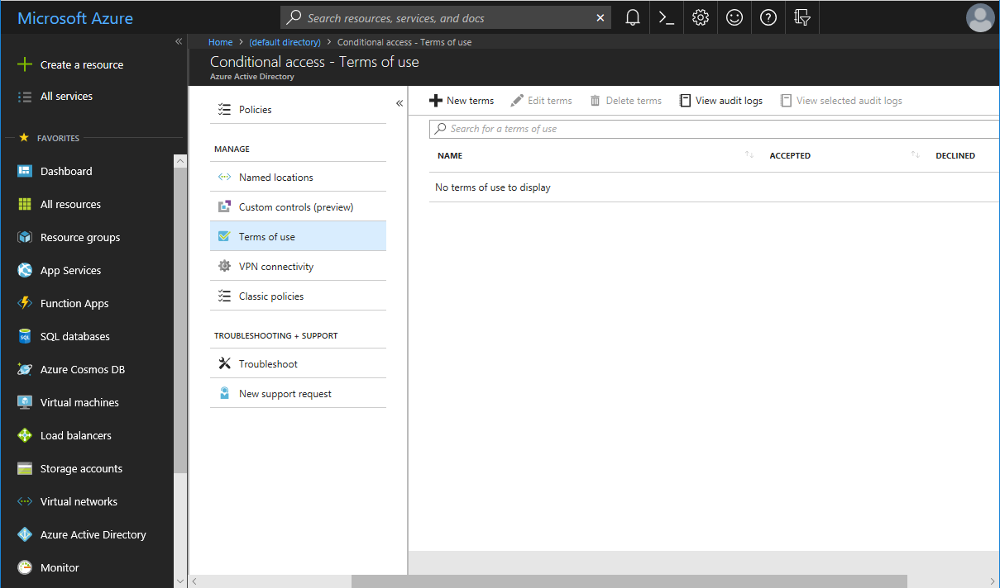
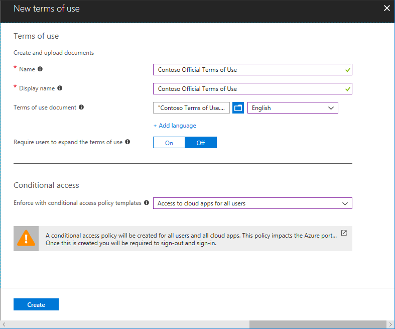
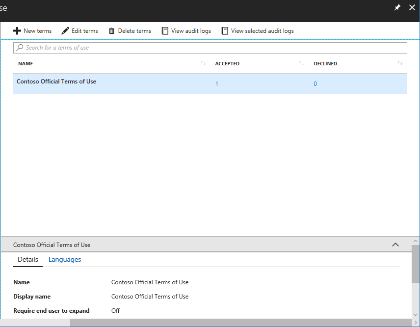
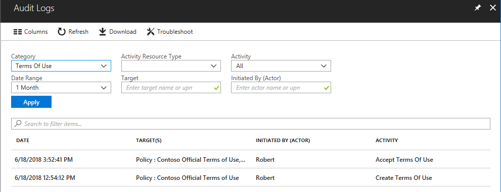
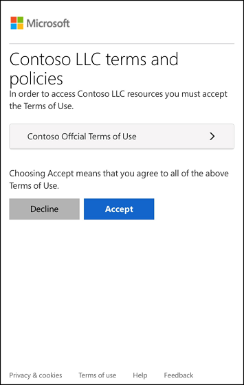
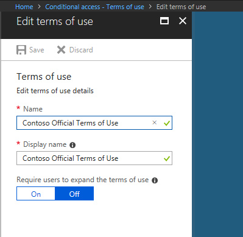
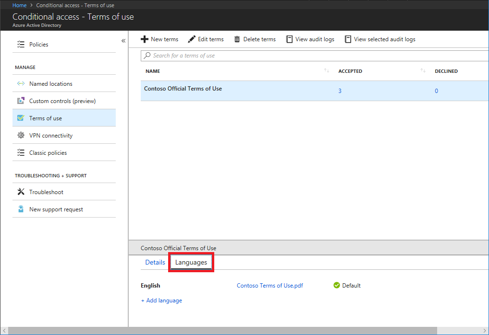
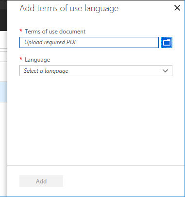

# Azure Active Directory Terms of use feature
Azure AD Terms of use provides a simple method that organizations can use to present information to end users. This presentation ensures users see relevant disclaimers for legal or compliance requirements. This article describes how to get started with Azure AD Terms of use.

[!INCLUDE [GDPR-related guidance](../../includes/gdpr-intro-sentence.md)]

## What can I do with Terms of use?
Azure AD Terms of use enables you to do the following:
- Require employees or guests to agree to your Terms of use before getting access.
- Present general Terms of use for all users in your organization.
- Present specific Terms of use based on a user attributes (ex. doctors vs nurses or domestic vs international employees, by using [dynamic groups](users-groups-roles/groups-dynamic-membership.md)).
- Present specific Terms of use when accessing high business impact applications, like Salesforce.
- Present Terms of use in different languages.
- List who has or hasn't agreed to your Terms of use.
- Display an audit log of Terms of use activity.

## Prerequisites
To use and configure Azure AD Terms of use, you must have:

- Azure AD Premium P1, P2, EMS E3, or EMS E5 subscription.
    - If you don't have one of theses subscriptions, you can [get Azure AD Premium](fundamentals/active-directory-get-started-premium.md) or [enable Azure AD Premium trial](https://azure.microsoft.com/trial/get-started-active-directory/).
- One of the following administrator accounts for the directory you want to configure:
    - Global administrator
    - Security administrator
    - Conditional access administrator

## Terms of use document

Azure AD Terms of use uses the PDF format to present content. The PDF file can be any content, such as existing contract documents, allowing you to collect end-user agreements during user sign in. The recommended font size in the PDF is 24.

## Add Terms of use
Once you have finalized your Terms of use document, use the following procedure to add it.

1. Sign in to Azure as a Global administrator, Security administrator, or Conditional access administrator.

1. Navigate to **Terms of use** at [https://aka.ms/catou](https://aka.ms/catou).

    

1. Click **New terms**.

    

1. Enter the **Name** for the Terms of use

2. Enter **Display name**.  This is the header that users see when they sign in.

3. **Browse** to your finalized Terms of use PDF and select it.

4. **Select** a language for the Terms of use.  The language option allows you to upload multiple Terms of use, each with a different language.  The version of the Terms of use that an end user will see will be based on their browser preferences.

5. For **Require users to expand the Terms of use**, select On or Off.  If this setting is set to On, end users will be required to view the Terms of use prior to accepting them.

6. Under **Conditional Access**, you can **Enforce** the uploaded Terms of use by selecting a template from the drop-down list or a custom conditional access policy.  Custom conditional access policies enable granular Terms of use, down to a specific cloud application or group of users.  For more information, see [configuring conditional access policies](active-directory-conditional-access-best-practices.md).

    >[!IMPORTANT]
    >Conditional access policy controls (including Terms of use) do not support enforcement on service accounts.  We recommend excluding all service accounts from the conditional access policy.

7. Click **Create**.

8. If you selected a custom conditional access template, then a new screen appears which allows you to customize the conditional access policy.

    You should now see your new Terms of use.

    

## View report of who has accepted and declined
The Terms of use blade shows a count of the users who have accepted and declined. These counts and who accepted/declined are stored for the life of the Terms of use.

1. Sign in to Azure and navigate to **Terms of use** at [https://aka.ms/catou](https://aka.ms/catou).

    

1. Click the numbers under **Accepted** or **Declined** to view the current state for users.

    

## View Azure AD audit logs
If you want to view additional activity, Azure AD Terms of use includes audit logs. Each user consent triggers an event in the audit logs that is stored for 30 days. You can view these logs in the portal or download as a .csv file.

To get started with Azure AD audit logs, use the following procedure:

1. Sign in to Azure and navigate to **Terms of use** at [https://aka.ms/catou](https://aka.ms/catou).

1. Click **View audit logs**.

    

1. On the Azure AD audit logs screen, you can filter the information using the provided drop-down lists to target specific audit log information.

    

1. You can also click **Download** to download the information in a .csv file for use locally.

## What Terms of use looks like for users
Once a Terms of use is created and enforced, users, who are in scope, will see the following screen during sign in.

The following screen shows how Terms of use looks on mobile devices.

### How users can review their Terms of use
Users can review and see the Terms of use that they have accepted by using the following procedure.

1. Sign in to [https://myapps.microsoft.com](https://myapps.microsoft.com).

1. In the upper right corner, click your name and select **Profile** from the drop-down.

    

1. On your Profile page, click **Review terms of use**.

    

1. From there, you can review the Terms of use you have accepted. 

## Edit Terms of use details
You can edit some details of Terms of use, but you can't modify an existing document. The following procedure describes how to edit the details.

1. Sign in to Azure and navigate to **Terms of use** at [https://aka.ms/catou](https://aka.ms/catou).

1. Select the Terms of use you want to edit.

1. Click **Edit terms**.

1. In the Edit terms of use pane, change the name, display name, or require users to expand values.

    

1. Click **Save** to save your changes.

    Once you save your changes, users will have to reaccept the new terms.

## Add a Terms of use language
The following procedure describes how to add a Terms of use language.

1. Sign in to Azure and navigate to **Terms of use** at [https://aka.ms/catou](https://aka.ms/catou).

1. Select the Terms of use you want to edit.

1. In the the details pane, click the **Languages** tab.

    

1. Click **Add language**.

1. In the Add terms of use language pane, upload your localized PDF and select the language.

    

1. Click **Add** to add the language.

## Delete Terms of use
You can delete old Terms of use using the following procedure.

1. Sign in to Azure and navigate to **Terms of use** at [https://aka.ms/catou](https://aka.ms/catou).

1. Select the Terms of use you want to remove.

1. Click **Delete terms**.

1. In the message that appears asking if you want to continue, click **Yes**.

    

    You should no longer see your Terms of use.

## Deleted users and active Terms of use
By default, a deleted user is in a deleted state in Azure AD for 30 days, during which time they can be restored by an administrator if necessary.  After 30 days, that user is permanently deleted.  In addition, using the Azure Active Directory portal, a Global administrator can explicitly [permanently delete a recently deleted user](fundamentals/active-directory-users-restore.md) before that time period is reached.  One a user has been permanently deleted, subsequent data about that user will be removed from the active Terms of use.  Audit information about deleted users remains in the audit log.

## Policy changes
Conditional access policies take effect immediately. When this happens, the administrator will start to see “sad clouds” or "Azure AD token issues". The administrator must sign out and sign in again in order to satisfy the new policy.

>[!IMPORTANT]
> Users in scope will need to sign-out and sign-in in order to satisfy a new policy if:
> - a conditional access policy is enabled on a Terms of use
> - or a second Terms of use is created

## Frequently asked questions

**Q: How do I see when/if a user has accepted a Terms of use?** 
A: On the Terms of use blade, click the number under **Accepted**. You can also view or search the accept activity in the Azure AD audit logs. For more information, see [View report of who has accepted and declined](#view-who-has-accepted-and-declined) and [View Azure AD audit logs](#view-azure-ad-audit-logs).
 
**Q: How long is information stored?** 
A: The user counts in the Terms of use report and who accepted/declined are stored for the life of the Terms of use. The Azure AD audit logs are stored for 30 days.

**Q: Why do I see a different number of consents in the Terms of use report vs. the Azure AD audit logs?** 
A: The Terms of use report is stored for the lifetime of that Terms of use, while the Azure AD audit logs are stored for 30 days. Also, the Terms of use report only displays the users current consent state. For example, if a user declines and then accepts, the Terms of use report will only show that user's accept. If you need to see the history, you can use the Azure AD audit logs.

**Q: If I edit the details for a Terms of use, does it require users to accept again?** 
A: Yes, if an administrator edits the details for a Terms of use, it requires users to reaccept the new terms.

**Q: Can I update an existing Terms of use document?** 
A: Currently, you can't update an existing Terms of use document. To change a Terms of use document, you will have to create a new Terms of use instance.

**Q: If hyperlinks are in the Terms of use PDF document, will end users be able to click them?** 
A: The PDF is rendered by default as a JPEG, so hyperlinks are not clickable. Users have the option to select **Having trouble viewing? Click here**, which renders the PDF natively where hyperlinks are supported.

**Q: Can a Terms of use support multiple languages?** 
A: Yes.  Currently there are 18 different languages an administrator can configure for a single Terms of use. 

**Q: When is the Terms of use triggered?** 
A: The Terms of use is triggered during the sign-in experience.

**Q: What applications can I target a Terms of use to?** 
A: You can create a conditional access policy on the enterprise applications using modern authentication.  For more information, see [enterprise applications](./manage-apps/view-applications-portal.md).

**Q: Can I add multiple Terms of use to a given user or app?** 
A: Yes, by creating multiple conditional access policies targeting those groups or applications. If a user falls in scope of multiple Terms of use, they agree to one Terms of use at a time.
 
**Q: What happens if a user declines the Terms of use?** 
A: The user is blocked from getting access to the application. The user would have to sign in again and agree to the terms in order to get access.
 
**Q: Is it possible to unaccept Terms of use that were previously accepted?** 
A: You can [review previously accepted Terms of use](#how-users-can-review-their-terms-of-use), but currently there isn't a way to unaccept.

## Next steps

- [Best practices for conditional access in Azure Active Directory](active-directory-conditional-access-best-practices.md)