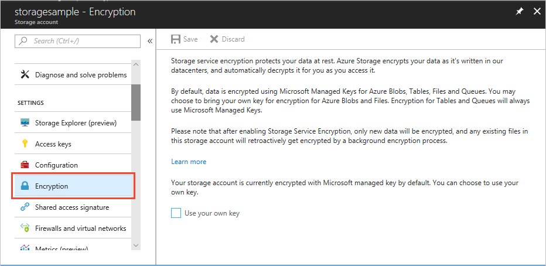

# Azure Storage Service Encryption for data at rest
Azure Storage Service Encryption for data at rest helps you protect your data to meet your organizational security and compliance commitments. With this feature, the Azure storage platform automatically encrypts your data before persisting it to Azure Blob storage, Azure Files, or Azure Queue storage, and decrypts the data before retrieval. The handling of encryption, encryption at rest, decryption, and key management in Storage Service Encryption is transparent to users. All data written to the Azure storage platform is encrypted through 256-bit [AES encryption](https://en.wikipedia.org/wiki/Advanced_Encryption_Standard), one of the strongest block ciphers available.

Storage Service Encryption is enabled for all new and existing storage accounts and cannot be disabled. Because your data is secured by default, you don't need to modify your code or applications to take advantage of Storage Service Encryption.

The feature automatically encrypts data in:

- Azure Blob storage, Azure Files, Azure Queue storage, Azure Table storage.  
- Both performance tiers (Standard and Premium).
- Both deployment models (Azure Resource Manager and classic).

> [!Note]  
> Storage Service Encryption is not available for [Azure Managed Disks](../../virtual-machines/windows/managed-disks-overview.md). We recommend you use encryption on the OS level, such as [Azure Disk Encryption](../../security/azure-security-disk-encryption-overview.md), which uses industry-standard [BitLocker](https://docs.microsoft.com/windows/security/information-protection/bitlocker/bitlocker-overview) on Windows and [DM-Crypt](https://en.wikipedia.org/wiki/Dm-crypt) on Linux to provide encryption integrated with KeyVault.

Storage Service Encryption does not affect the performance of Azure storage services.

You can use Microsoft-managed encryption keys with Storage Service Encryption, or you can use your own encryption keys. For more information about using your own keys, see [Storage Service Encryption using customer-managed keys in Azure Key Vault](storage-service-encryption-customer-managed-keys.md).

## View encryption settings in the Azure portal
To view settings for Storage Service Encryption, sign in to the [Azure portal](https://portal.azure.com) and select a storage account. In the **SETTINGS** pane, select the **Encryption** setting.

## FAQ for Storage Service Encryption
**How do I encrypt the data in a Resource Manager storage account?**  
Storage Service Encryption is enabled for all storage accounts--classic and Resource Manager, any existing files in the storage account created before encryption was enabled will retroactively get encrypted by a background encryption process.

**Is Storage Service Encryption enabled by default when I create a storage account?**  
Yes, Storage Service Encryption is enabled for all storage accounts and for all Azure storage services.

**I have a Resource Manager storage account. Can I enable Storage Service Encryption on it?**  
Storage Service Encryption is enabled by default on all existing Resource Manager storage accounts. This is supported for Azure Blob storage, Azure Files, Azure Queue storage, Table storage. 

**Can I disable encryption on my storage account?**  
Encryption is enabled by default, and there is no provision to disable encryption for your storage account. 

**How much more does Azure Storage cost if Storage Service Encryption is enabled?**  
There is no additional cost.

**Can I use my own encryption keys?**  
Yes, you can use your own encryption keys. For more information, see [Storage Service Encryption using customer-managed keys in Azure Key Vault](storage-service-encryption-customer-managed-keys.md).

**Can I revoke access to the encryption keys?**  
Yes, if you [use your own encryption keys](storage-service-encryption-customer-managed-keys.md) in Azure Key Vault.

**Is Storage Service Encryption available on Azure Managed Disks?**  
No, Storage Service Encryption is not available for [Azure Managed Disks](../../virtual-machines/windows/managed-disks-overview.md). We recommend you use encryption on the OS level, such as [Azure Disk Encryption](../../security/azure-security-disk-encryption-overview.md), which uses industry-standard [BitLocker](https://docs.microsoft.com/windows/security/information-protection/bitlocker/bitlocker-overview) on Windows and [DM-Crypt](https://en.wikipedia.org/wiki/Dm-crypt) on Linux to provide encryption integrated with KeyVault.

**How is Storage Service Encryption different from Azure Disk Encryption?**  
Azure Disk Encryption provides integration between OS-based solutions like BitLocker and DM-Crypt and Azure KeyVault. Storage Service Encryption provides encryption natively at the Azure storage platform layer, below the virtual machine.

**I have a classic storage account. Can I enable Storage Service Encryption on it?**  
Storage Service Encryption is enabled for all storage accounts (classic and Resource Manager).

**How can I encrypt data in my classic storage account?**  
With encryption enabled by default, any data stored in Azure storage services is automatically encrypted. 

**Can I create storage accounts with Storage Service Encryption enabled by using Azure PowerShell and Azure CLI?**  
Storage Service Encryption is enabled by default at the time of creating any storage account (classic or Resource Manager). You can verify account properties by using both Azure PowerShell and Azure CLI.

**My storage account is set up to be replicated geo-redundantly. With Storage Service Encryption, will my redundant copy also be encrypted?**  
Yes, all copies of the storage account are encrypted. All redundancy options are supported--locally redundant storage, zone-redundant storage, geo-redundant storage, and read-access geo-redundant storage.

**Is Storage Service Encryption permitted only in specific regions?**  
Storage Service Encryption is available in all regions.

**Is Storage Service Encryption FIPS 140-2 compliant?**  
Yes, Storage Service Encryption is FIPS 140-2 compliant.

**How do I contact someone if I have any problems or want to provide feedback?**  
Contact [ssediscussions@microsoft.com](mailto:ssediscussions@microsoft.com) for any problems or feedback related to Storage Service Encryption.

## Next steps
Azure Storage provides a comprehensive set of security capabilities that together help developers build secure applications. For more information, see the [Storage security guide](../storage-security-guide.md).